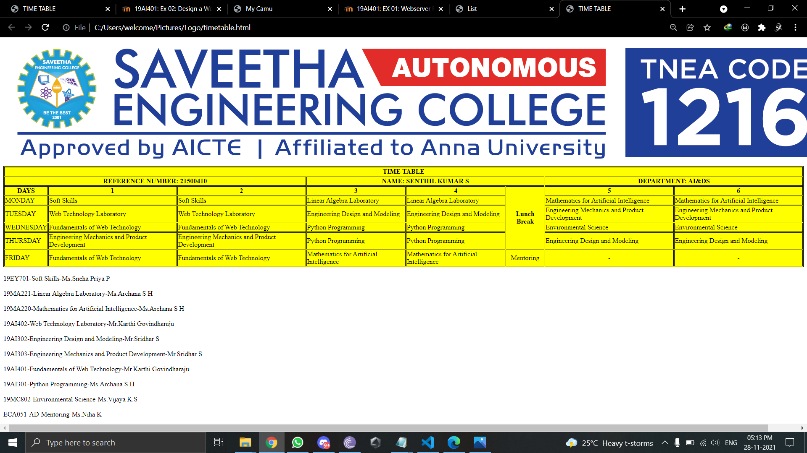

# Experiment_Time_Table

## AIM
To Write a html webpage page to display your timetable.

# ALGORITHM
### STEP 1
create a simple table using table tag
### STEP 2
Add header row using th tag
### STEP 3
Add your timetable
### STEP 4
Execute the program

# CODE
~~~<!DOCTYPE html>
<html>

   <head>
      <title>TIME TABLE</title>
   </head>
	
   <body>
      
      <table border = "1" cellspacing="1" bordercolor="black" bgcolor="yellow">
         <tr>
            <th colspan="8">TIME TABLE</th>
         </tr>
            <th colspan="3">REFERENCE NUMBER: 21500410</th>
            <th colspan="3">NAME: SENTHIL KUMAR S</th>
            <th colspan="8">DEPARTMENT: AI&DS</th>
        </tr>
         
         <tr>
            <th>DAYS</th>
            <th>1</th>
            <th>2</th>
            <th>3</th>
            <th>4)</th>
            <th rowspan="5">Lunch Break</th>
            <th>5</th>
            <th>6</th>
         </tr>

<tr>
             <td>MONDAY</td>
             <td>Soft Skills</td>
             <td>Soft Skills</td>
             <td>Linear Algebra Laboratory</td>
             <td>Linear Algebra Laboratory</td>
             <td>Mathematics for Artificial Intelligence</td>
             <td>Mathematics for Artificial Intelligence</td>
         </tr>

<tr>
             <td>TUESDAY</td>
             <td>Web Technology Laboratory</td>
             <td>Web Technology Laboratory</td>
             <td>Engineering Design and Modeling</td>
             <td>Engineering Design and Modeling</td>
             <td>Engineering Mechanics and Product Development</td>
             <td>Engineering Mechanics and Product Development</td>
         </tr>

<tr>
             <td>WEDNESDAY</td>
             <td>Fundamentals of Web Technology</td>
             <td>Fundamentals of Web Technology</td>
             <td>Python Programming</td>
             <td>Python Programming</td>
             <td>Environmental Science</td>
             <td>Environmental Science</td>
         </tr>

<tr>
             <td>THURSDAY</td>
             <td>Engineering Mechanics and Product Development</td>
             <td>Engineering Mechanics and Product Development</td>
             <td>Python Programming</td>
             <td>Python Programming</td>
             <td>Engineering Design and Modeling</td>
             <td>Engineering Design and Modeling</td>
         </tr>

<tr>
             <td>FRIDAY</td>
             <td>Fundamentals of Web Technology</td>
             <td>Fundamentals of Web Technology</td>
             <td>Mathematics for Artificial Intelligence</td>
             <td>Mathematics for Artificial Intelligence</td>
             <td align="center">Mentoring</td>
             <td align="center">-</td>
             <td align="center">-</td>
         </tr>  
         
      </table>
      
   </body>
</html>

~~~
# OUTPUT

